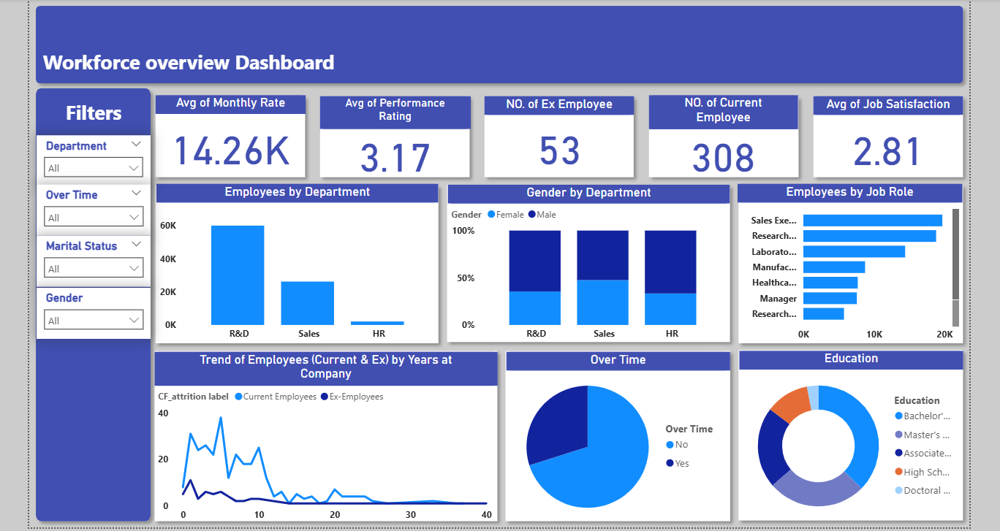

# Workforce Overview Dashboard

This project presents a Power BI dashboard for analyzing HR workforce data, focusing on attrition, department distribution, job roles, education, and employee satisfaction metrics.

## 📊 Dashboard Summary

The **Workforce Overview Dashboard** helps HR teams monitor employee trends and gain insights into various workforce aspects. It includes slicers for department, overtime status, marital status, and gender to provide flexible filtering.

### 🧩 Key KPIs
- **Avg. Monthly Rate:** 14.26K  
- **Avg. Performance Rating:** 3.17  
- **No. of Ex-Employees:** 53  
- **No. of Current Employees:** 308  
- **Avg. Job Satisfaction:** 2.81  

### 📈 Visualizations Included:
- Employees by Department
- Gender by Department
- Employees by Job Role
- Trend of Employees (Current & Ex) by Years at Company
- Overtime Breakdown
- Education Distribution

## 🖼️ Dashboard Preview

## 📁 Files

- `hr_data.csv` — Cleaned HR dataset used for visualization  
- `workforce_overview_dashboard.pbix` — Power BI dashboard file  
- `workforce overview dashboard.png` — Screenshot of the dashboard  

## 🛠️ Tools Used

- Power BI
- Excel / CSV
- Git & GitHub

---

> Built with 📊 by [Moataz Emad] – HR data never looked better!
